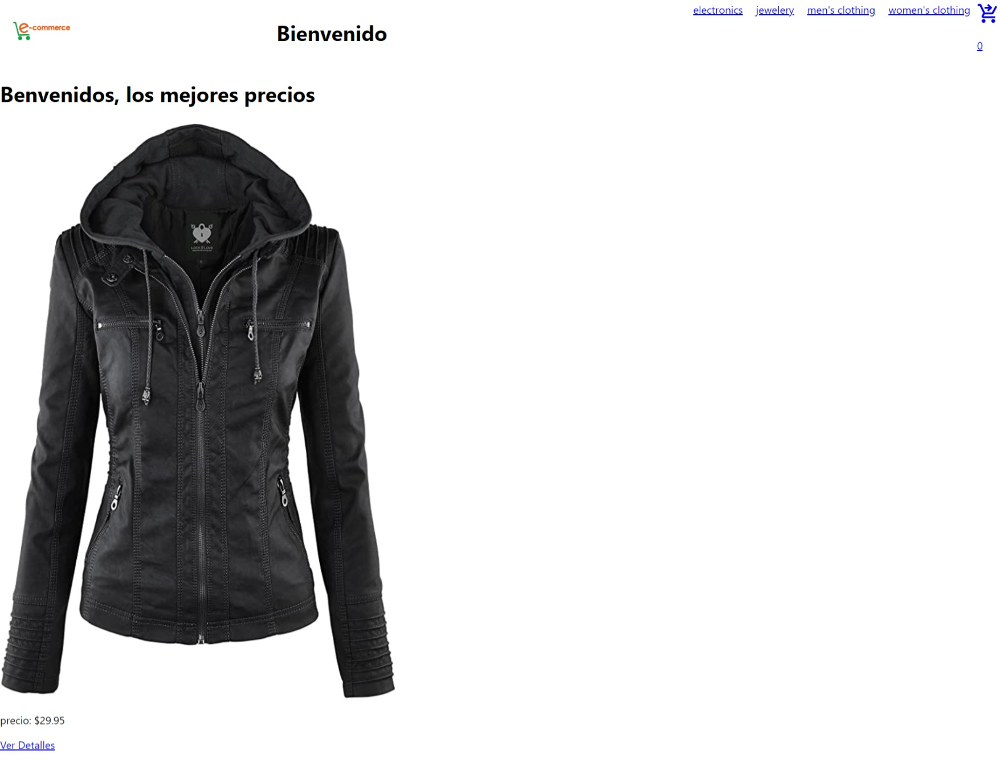

# Proyecto E-Commerce ds

Mi nombre es Emilio Pernicone, este proyecto presenta el desarrollo de un E-commerce de una tienda ficticia.

---------------------------------------------------
## Objetivo

Desarrollar un e-commerce que simule la realidad utilizando React JS para presentarlo como proyecto final del Curso React JS de CoderHouse.

---------------------------------------------------
## Screenshot
####Home Tienda

---------------------------------------------------
## 🛠 Tecnologias Utilizadas

| Parameter  | Type                       |
| :--------  | :-------                   |
| HTML       | `Estructura y maquetación` |
| CSS        | `Estética y diseño`        |
| JavaScript | `Programación de funciones del e-commerce` |
| React.js   | `Interfaz de usuario (SPA)`|
| Node.js    | `Ejecución de JavaScript`  |
| Git        | `Control de versiones y repositorio` |
| Material Icons UI | `Libreria de iconos`|
| React Router DOM | `Navegacion entre componentes`|
| Firebase | `Base de datos personalizada del proyecto`|

---------------------------------------------------
##Links

[Link al Repositorio](https://github.com/EmilioPernicone/ReactEmilio)
[Link a la Web](https://react-emilio-pernicone.netlify.app/)